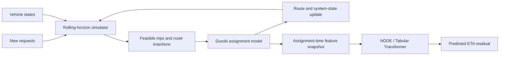

# Dynamic Ridepooling: Assignment and ETA Residual Prediction

> A publication-safe portfolio edition of a master's research project in dynamic ridepooling, operations research, and machine learning.

[](https://www.python.org/)
[](https://www.gurobi.com/)
[](https://pytorch.org/)
[](#publication-status)

## Overview

Dynamic ridepooling platforms repeatedly revise vehicle routes as new requests arrive. A passenger's drop-off estimate at assignment can therefore differ from the final realised ETA. This project studies that post-assignment uncertainty through a combined optimization-and-learning workflow:

1. simulate request arrivals and vehicle states in rolling decision epochs;
2. generate feasible request-trip-vehicle combinations under service constraints;
3. solve the conflict-free assignment problem with integer optimization;
4. capture passenger, trip, vehicle, slack, demand, and shareability-aware features at assignment;
5. predict the residual between realised ETA and the planner's assignment-time ETA;
6. evaluate accuracy and transfer across different fleet configurations.

The full research pipeline produced passenger-level data under six fleet configurations and 60 simulated operating days. Only a selected, sanitized implementation and high-level findings are included here.

## System workflow



## Optimization layer

At each decision epoch, the assignment layer selects at most one candidate trip for each vehicle while ensuring that a request is served at most once. Candidate trips are generated only after checking operational feasibility, including vehicle capacity, pickup waiting limits, drop-off delay limits, and route compatibility.

The public example in [`src/optimization/assignment.py`](src/optimization/assignment.py) exposes this selection problem without releasing the complete research simulator or route-generation logic.

## ETA residual learning

The prediction target is:

```text
ETA residual = realised drop-off ETA - planned total ETA at assignment
corrected ETA = planned total ETA at assignment + predicted residual
```

Only information available at assignment is used. The research feature families include:

- planned trip and shortest-path information;
- pickup-waiting and drop-off-delay slack;
- vehicle capacity, available seats, and current passenger load;
- local origin-destination demand context;
- instantaneous shareability exposure;
- planned path and service-region context.

NODE is the primary tabular model. A compact Transformer encoder is used as a comparison model for learning interactions among numeric assignment-time features.

## Selected high-level findings

To protect the manuscript while it remains under review, this portfolio reports trends rather than full tables or final figure sets:

- assignment-time shareability exposure is consistently informative for later ETA revisions;
- moderate residual changes are easier to anticipate than rare, large deviations;
- NODE and the tabular Transformer show broadly similar performance;
- model transfer is asymmetric across fleet policies;
- training on heterogeneous fleet conditions gives more consistent cross-fleet behaviour.

Exact metrics, complete transfer matrices, ablation results, model checkpoints, and manuscript figures are intentionally withheld.


## Quick start

```bash
python -m venv .venv
# Windows: .venv\Scripts\activate
# macOS/Linux: source .venv/bin/activate
pip install -r requirements.txt
python -m pytest
```

Gurobi requires a valid local license. The optimization example is importable without a license, but solving a model requires a working Gurobi installation.

## Publication status

The associated manuscript is under review. This repository is designed for portfolio review, not full paper reproduction. It intentionally excludes:

- the manuscript and presentation files;
- author, student ID, institution, supervisor, and submission metadata;
- raw, licensed, restricted, or full generated datasets;
- full simulation parameters and complete experiment scripts;
- model checkpoints and exhaustive result artifacts;
- unpublished ablations and manuscript-ready figures;
- third-party source trees copied into the research workspace.

See [`docs/PUBLIC_RELEASE_CHECKLIST.md`](docs/PUBLIC_RELEASE_CHECKLIST.md) before making the repository public.

## Responsible release

Do not treat this repository as cleared for public release until the author has confirmed the venue's anonymity policy, obtained any required supervisor or co-author approval, and checked the provenance and license of every file.

## License

No open-source license is granted at this stage. All rights are reserved while the manuscript is under review. A license can be added after publication and ownership review.

